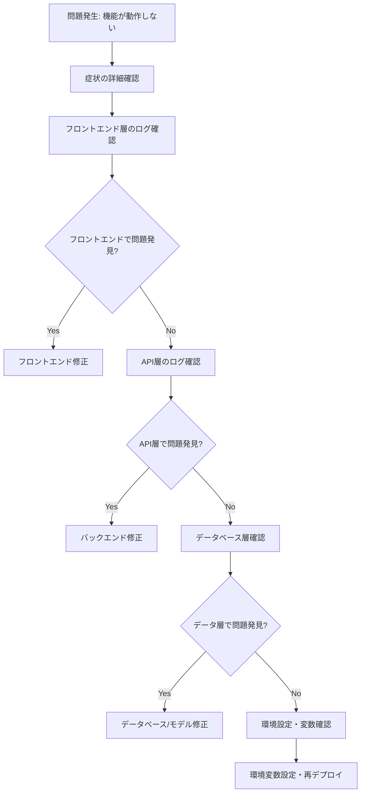

# 管理者権限表示問題 - トラブルシューティングガイド

## 📋 問題概要

### 発生日時
2025年6月23日

### 症状
- `admin@example.com` でログインしても管理者メニューが表示されない
- 以前のモック環境では正常に動作していた
- ログイン自体は成功するが APIレスポンスで `isAdmin: false` が返される
- フロントエンドでAuthContextが正常に動作しているにも関わらず管理者フラグが無効

## 🔍 調査・デバッグ過程

### 段階1: フロントエンド調査
**仮説**: AuthContextの処理に問題がある

**実施内容**:
```javascript
// src/contexts/AuthContext.tsx に詳細ログ追加
console.log('🔥🔥🔥 [AuthContext] PROVIDER FUNCTION CALLED!');
console.log('🔥🔥🔥 [AuthContext] LOGIN FUNCTION CALLED!');
console.log('🔥🔥🔥 [AuthContext] isAdmin in login data:', userData.isAdmin);
```

**結果**: 
- AuthContextは正常に動作
- **APIから既に `isAdmin: false` で返ってくることが判明**

### 段階2: バックエンドAPI調査
**仮説**: サーバー側のログイン処理に問題がある

**実施内容**:
```javascript
// server/controllers/authController.js に詳細ログ追加
logger.debug(`🔥🔥🔥 [AuthController] Found user: ${user.username}, isAdmin: ${user.isAdmin}`);
logger.debug(`🔥🔥🔥 [AuthController] User object keys:`, Object.keys(user));
```

**結果**: 
- サーバー側でも `isAdmin: false` が返されている
- **問題はさらに下層（データベース層）にある**

### 段階3: データベース・モデル層調査
**仮説**: Userモデルの処理でisAdminフラグが失われている

**実施内容**:
```javascript
// server/models/User.js のselect処理にログ追加
logger.debug(`🔥🔥🔥 [UserModel] isAdmin: ${userWithMethod.isAdmin}`);
logger.debug(`🔥🔥🔥 [UserModel] All user properties:`, Object.keys(userWithMethod));

// server/config/database.js のfindMockUser関数にログ追加
logger.debug(`🔥🔥🔥 [findMockUser] isAdmin: ${user.isAdmin}`);
logger.debug(`🔥🔥🔥 [findMockUser] typeof isAdmin: ${typeof user.isAdmin}`);
```

**結果**: 
- UserModelのログが表示されない
- **findMockUserが呼ばれていない → モック環境が有効になっていない**

### 段階4: 環境設定調査（根本原因発見）
**仮説**: モック環境の設定に問題がある

**実施内容**:
```bash
# Vercel環境変数確認
vercel env ls
```

**結果**: 
```
name               value               environments                        
NODE_ENV           Encrypted           Development, Preview, Production    
JWT_EXPIRES_IN     Encrypted           Development, Preview, Production    
MONGODB_URI        Encrypted           Production, Preview, Development    
# ❌ MONGODB_MOCK が存在しない！
```

**🎯 根本原因判明**: 
**Vercel環境で `MONGODB_MOCK=true` が設定されていないため、モックデータではなく実際のMongoDBに接続しようとしていた**

## ✅ 解決方法

### 1. Vercel環境変数の設定
```bash
# 全環境にMONGODB_MOCK=trueを設定
echo "true" | vercel env add MONGODB_MOCK production
echo "true" | vercel env add MONGODB_MOCK preview  
echo "true" | vercel env add MONGODB_MOCK development
```

### 2. 設定確認
```bash
vercel env ls
# 結果:
# MONGODB_MOCK       Encrypted           Development                         
# MONGODB_MOCK       Encrypted           Preview                             
# MONGODB_MOCK       Encrypted           Production                          
```

### 3. 再デプロイ
```bash
vercel --prod
```

### 4. 動作確認
- `admin@example.com` でログインテスト
- コンソールで以下のログが表示されることを確認:
  - `🔥🔥🔥 [initializeMockData] モックデータ初期化開始！`
  - `Environment: MONGODB_MOCK=true`
  - `🔥🔥🔥 [findMockUser] isAdmin: true`

## 📝 学んだ教訓

### 1. 環境変数の一貫性の重要性
**問題**: ローカル開発環境（`.env`ファイル）とクラウドデプロイ環境で設定が異なる

**対策**:
- デプロイ前の環境変数チェックリスト作成
- 必要な環境変数を自動チェックするスクリプト実装
- CI/CDパイプラインでの環境変数検証

### 2. 段階的デバッグの有効性
**プロセス**: フロントエンド → API → データベース → 環境設定の順で調査

**学び**: 
- 各層に詳細なデバッグログを仕込むことで問題箇所を特定可能
- 「動作していた機能が突然動かなくなった」場合は環境設定を疑う

### 3. モック環境の依存関係管理
**問題**: モック環境での開発は便利だが、本番環境でも同じ設定が必要

**対策**:
- モック環境専用の設定ドキュメント作成
- 環境変数テンプレートファイルの提供

## 🛠️ 予防策・改善案

### 1. 環境変数チェックスクリプト
```javascript
// scripts/check-env.js
const requiredEnvVars = {
  'MONGODB_MOCK': 'モック環境フラグ',
  'JWT_SECRET': 'JWT署名キー', 
  'MONGODB_URI': 'MongoDB接続文字列'
};

Object.entries(requiredEnvVars).forEach(([envVar, description]) => {
  if (!process.env[envVar]) {
    console.error(`❌ Missing: ${envVar} (${description})`);
    process.exit(1);
  } else {
    console.log(`✅ Found: ${envVar}`);
  }
});
```

### 2. ヘルスチェックエンドポイント
```javascript
// server/routes/healthRoutes.js
app.get('/api/health', (req, res) => {
  res.json({
    status: 'ok',
    environment: {
      node_env: process.env.NODE_ENV,
      mongodb_mock: process.env.MONGODB_MOCK,
      has_jwt_secret: !!process.env.JWT_SECRET
    },
    timestamp: new Date().toISOString()
  });
});
```

### 3. デプロイ前チェックリスト
- [ ] 必要な環境変数がすべて設定されているか
- [ ] ローカル環境とデプロイ環境で動作が一致するか  
- [ ] モック環境での管理者権限テスト実行
- [ ] `/api/health` エンドポイントで設定確認

## 🔄 類似問題への対応フロー



## 📚 参考コマンド集

### Vercel環境変数管理
```bash
# 一覧表示
vercel env ls

# 環境変数追加
vercel env add VARIABLE_NAME
# または
echo "value" | vercel env add VARIABLE_NAME environment

# 環境変数削除  
vercel env rm VARIABLE_NAME environment

# プロジェクト情報
vercel project ls
```

### デバッグ・ログ確認
```bash
# Vercelログ確認
vercel logs

# リアルタイムログ
vercel logs --follow

# ローカル開発
vercel dev
```

### Git履歴確認
```bash
# 最近のコミット
git log --oneline -10

# 変更内容確認
git diff HEAD~1

# 特定ファイルの変更履歴
git log -p filename
```

## 🎯 今後の改善計画

1. **自動化**: 
   - 環境変数チェックをGitHub Actionsに組み込み
   - デプロイ前の自動テスト追加

2. **監視**: 
   - 本番環境での認証関連エラーのアラート設定
   - 管理者権限機能のヘルスチェック

3. **ドキュメント**: 
   - 環境設定手順書の詳細化
   - 新規開発者向けのセットアップガイド

4. **テスト**: 
   - 環境依存機能の自動テスト追加
   - モック環境と本番環境の動作一致テスト

---

**注意**: このドキュメントは今後の開発で類似問題が発生した際の参考資料として活用してください。同様の問題に遭遇した場合は、まず環境変数の設定を確認することをお勧めします。 